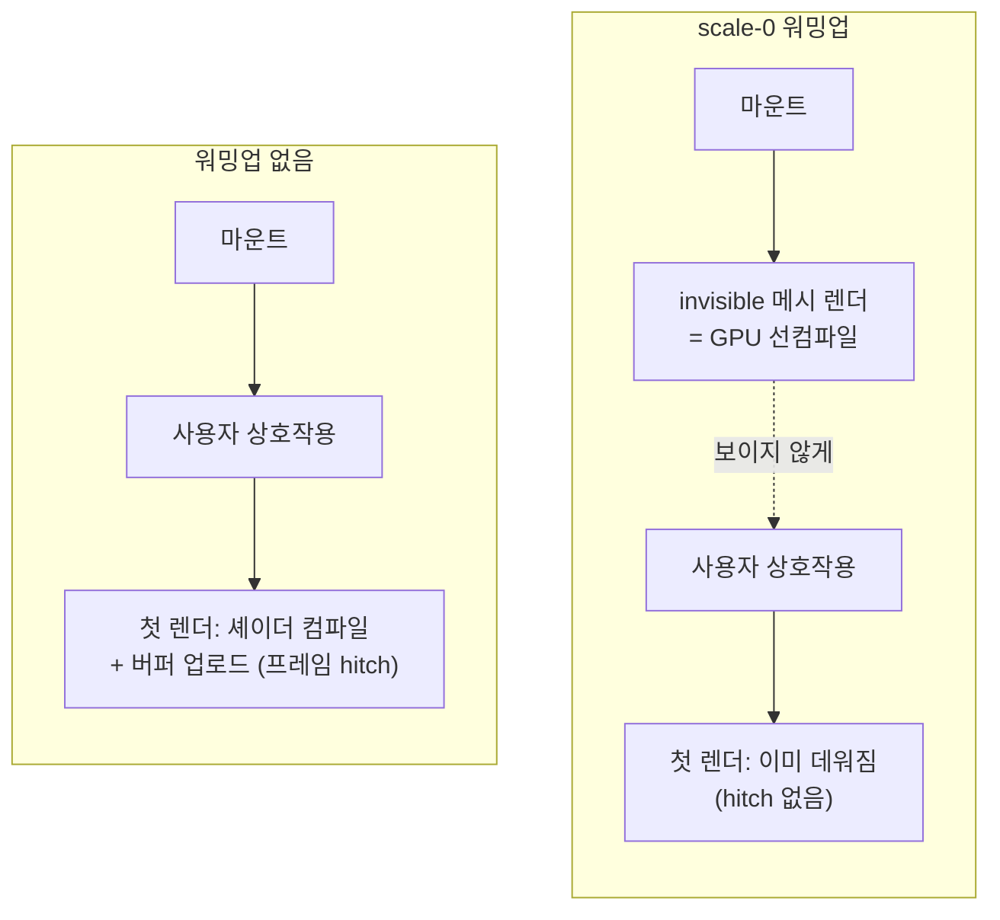

실시간 3D 인터페이스를 오래된 스택(Three.js 0.13x / R3F 7)에서 최신(Three.js r18x /
R3F 9)으로 재작성했다. 대부분은 그냥 마이그레이션 노동이었는데 한 증상이 유독
반복해서 나왔다.

> 3D 오브젝트가 화면에 처음 등장하는 그 한 프레임만 이상하게 깜빡인다.
> 두 번째부터는 멀쩡하다. 에러도, 경고도, 콘솔 로그도 없다.

한참 뒤에야 알았는데 이건 한 가지 버그가 아니었다. 원인이 서로 다른 깜빡임 세 개가
같은 증상으로 보였을 뿐이고, 각각 다른 층위에서 잡아야 했다.

## 1. 첫 프레임에 원점에 찍힌다

3D 오브젝트를 특정 위치에서 등장시키는데, 마운트되는 첫 프레임에 화면 중앙(원점)에
잠깐 찍혔다가 다음 프레임에 제 위치로 날아갔다.

렌더 순서 문제였다. 위치를 `useEffect` 안에서 `position.copy()`로 세팅하면 effect는
첫 페인트 이후에 실행된다. 그래서 첫 프레임은 group의 기본 좌표 `(0,0,0)`으로 그려진다.

위치를 첫 렌더에 직접 넘기면 된다. `useState`의 lazy initializer는 마운트 시 1회만
실행되니 거기서 애니메이션 경로의 시작점을 계산해 `<group position>`으로 바로 전달했다.

```tsx
// useEffect 안에서 position.copy 만 하면 첫 프레임은 (0,0,0) = 화면 중앙에서
// 오브젝트가 깜빡 나타났다 사라진다. lazy initializer로 첫 프레임부터 정확한 좌표.
const [initialPos] = useState<[number, number, number]>(() => {
  const p = anim.path.getPoint(0);
  return [p.x, p.y, p.z];
});
```

## 2. 애니메이션 루프가 effect보다 먼저 돈다

던지기 애니메이션의 시작 시각을 `useEffect`에서 세팅했더니, 던지기 직전 한 프레임에
오브젝트가 착지 지점으로 순간이동했다.

R3F의 실행 순서 문제다. R3F의 프레임 루프(`useFrame`, requestAnimationFrame 기반)는
passive effect보다 먼저 돌 수 있다. 그래서 마운트 직후 첫 프레임에서 시작 시각이 아직
`null`이고, 그 프레임의 루프가 "아직 시작 안 했네" 하고 오브젝트를 최종 위치로
스냅해버린다.

`useEffect`를 `useLayoutEffect`로 바꾸니 사라졌다. layout effect는 커밋 직후, 페인트
전, 다음 프레임 루프 전에 동기 실행되니까 첫 프레임부터 시작 시각이 채워져 있다.

```tsx
// useEffect로 startAt을 세팅하면 첫 useFrame 시점에 아직 null이라 착지점으로 스냅
// → "착지점 깜빡임". layout effect는 paint·다음 RAF 전에 동기 실행되어 깜빡임 없음.
useLayoutEffect(() => {
  if (rolling && !prev.current) startAtRef.current = performance.now();
  prev.current = rolling;
}, [rolling, face]);
```

## 3. 첫 등장에서 셰이더를 그제야 컴파일한다

셋 중 제일 잡기 어려웠다. 오브젝트가 처음 씬에 올라가는 순간 프레임이 뚝 끊겼다가
이어졌다. 위치도 타이밍도 맞는데 렌더 자체가 hitch를 냈다.

GPU 쪽이었다. 그 오브젝트의 메시가 처음 렌더되는 시점에 WebGL이 셰이더 프로그램을
컴파일하고 지오메트리 버퍼를 업로드한다. 이 작업이 프레임 안에서 동기적으로 일어나
프레임을 넘긴다. 두 번째부터 멀쩡한 건 이미 컴파일과 업로드가 끝났기 때문이다.

로직 버그가 아니라 GPU 자원 초기화 비용을 사용자가 보는 순간에 지불하고 있던 거였다.
그러면 비용을 미리 지불하면 된다. 화면에 처음 필요해지기 전에 보이지 않는 메시를
렌더해 GPU를 데워둔다.



여기서 중요한 건 워밍업 메시가 실제 메시와 같은 지오메트리·머티리얼을 공유한다는
점이다. 그래야 컴파일되는 셰이더 프로그램과 업로드되는 버퍼가 동일해서, 나중에 진짜로
등장할 때 GPU가 이미 아는 것이 된다.

```tsx
// 첫 등장 전까지 이 메시는 씬에 없다 → 첫 등장에 셰이더 컴파일 + 버퍼 업로드 hitch.
// 마운트 시점부터 scale 0(안 보임)으로 렌더해 GPU를 미리 데운다. 실제 렌더와
// geometry·material을 공유해야 같은 셰이더가 선컴파일된다.
function Warmup() {
  return (
    <group scale={[0, 0, 0]} dispose={null}>
      <SharedMeshes />
    </group>
  );
}
```

## 곁다리: 적정값은 계산이 아니라 반복 측정이었다

Three.js r155 전후로 조명 intensity 단위와 색 공간(sRGB) 처리가 바뀌어서, 구버전과
같은 밝기를 내려면 값을 다시 잡아야 했다. 정공식대로 환산해도 텍스처가 미묘하게
어긋났고, 결국 눈으로 맞췄다. 그 과정이 코드 주석에 그대로 남아 있다.

```
조명: π*2 (너무 밝음) → π*0.5 (너무 어두움) → π*1.1 (적정)
흰 면 색: #fffaee (너무 밝음) → #bbb5a5 (너무 어두움) → #d8d2c0 (적정)
```

자랑할 일은 아니고 오히려 한계다. "적정"의 근거가 측정 지표가 아니라 내 눈이다. 다른
디스플레이나 색 프로파일에서 같게 보인다는 보장이 없다. 지각 균일 색공간에서 델타를
재는 게 옳은 방식인데 거기까지는 하지 못했다.

## 정리

"첫 프레임만 깜빡인다"는 하나의 증상이었는데 원인은 세 층에 흩어져 있었다. 리액트
렌더 순서, 이펙트 실행 타이밍, GPU 자원 초기화. 해법도 `useState` lazy init,
`useLayoutEffect`, 워밍업 메시로 층마다 달랐다.

공통점은 있다. 셋 다 정상 상태에서는 완벽히 동작하고 전이의 첫 순간에만 비용이
드러났다. 애니메이션이나 인터랙션 버그의 상당수가 정상 프레임이 아니라 첫 프레임과
전이 프레임에 숨어 있는데, 에러를 안 던지니 로그로는 안 잡힌다. 눈으로 보고 렌더
파이프라인의 순서를 되짚어야 나온다.
