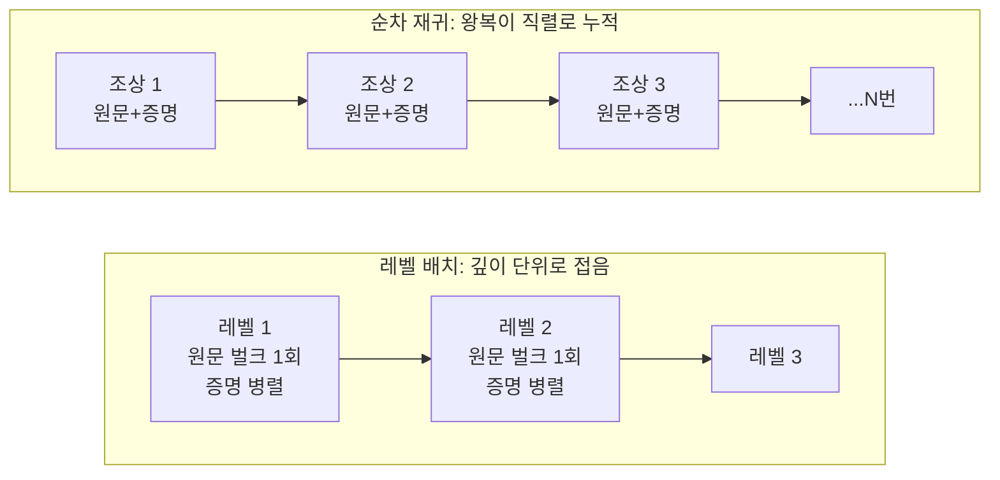

0-컨펌 정산 시스템([관련 글](/posts/zeroconf-settlement/))에서 입금 하나가 69초 걸린 걸
관측했다. 목표가 "수 초"인 시스템에서 69초는 사실상 장애다.

느린 걸 빠르게 만드는 방법은 많은데 대부분은 틀린 방법이다. 무엇이 느린지 재기 전에
손대면 병목이 아닌 곳을 최적화하고 복잡도만 남는다.

## 무슨 일이 있었나

입금을 지갑에 등록하려면 그 트랜잭션의 SPV 증명을 조립해야 한다. 조상 트랜잭션들을
거슬러 올라가며 각각의 원문과 머클 증명을 모아 하나의 묶음(BEEF)으로 만드는 작업이다.
조상 데이터는 외부 인덱서 API에서 가져온다.

문제가 난 건 입력 83개를 통합한 입금이었다. 평소 입금은 입력이 몇 개뿐이라 1~2초에
끝나는데 이 건만 69초가 나왔다.

## 재귀가 아니라 직렬이 문제였다

쓰던 라이브러리 구현은 조상을 순차 재귀로 훑었다. 조상 하나를 만나면 원문 한 번,
머클 증명 한 번. 외부 API를 두 번 왕복하고 그 응답을 받아야 다음 조상으로 넘어간다.

진짜 문제는 재귀가 아니라 왕복이 직렬로 쌓인다는 점이다. 조상이 N개면 왕복도 N번이고
각 왕복의 지연이 그대로 더해진다. 83입력짜리가 69초가 된 건 API가 느려서가 아니라
기다림을 쌓았기 때문이다.

낭비도 두 군데 있었다. 아직 블록에 안 들어간 미확정 트랜잭션에도 머클 증명을
요청하고 있었다. 존재할 수 없는 증명을 받으려고 매번 왕복을 썼다는 뜻이다. 원문
조회에는 인덱서가 여러 txid를 한 번에 주는 벌크 엔드포인트를 제공하는데, 그걸
안 쓰고 단건으로 호출하고 있었다.

## 깊이를 병렬로 접는다

조상 그래프는 트리다. 같은 깊이의 조상들은 서로 의존하지 않는다. 순차 재귀는 이
사실을 그냥 버리고 있었다. 그래서 DFS 재귀를 BFS 레벨 배치로 바꿨다.

왕복 횟수가 조상 수(N)에서 트리 깊이로 줄었다. 83입력짜리도 깊이는 한 자릿수였다.

레벨 안에서는 데이터 종류에 따라 처리를 다르게 했다. 같은 "병렬"로 뭉뚱그리지 않은
건 API가 제공하는 게 서로 달라서다.

| 데이터 | 벌크 API | 처리 |
|---|---|---|
| 트랜잭션 원문 | 있음 | txid 20개씩 묶어 벌크 1회, 요청 예산 20배 절약 |
| 머클 증명 | 없음 | 확정된 것만 병렬 단건. 미확정은 아예 호출 안 함 |

증명 조회에 폴백 인덱서를 두되 교차 분산이 아니라 실패할 때만 쓰도록 했다. 폴백 쪽은
초당 한도는 넉넉한데 일일 총량 제한이 있다. 평소에 나눠 쓰면 정작 주 인덱서가 죽었을
때 예산이 남아 있지 않다. 무료 티어의 제약이 초당이 아니라 일일이라는 걸 안 읽었으면
정확히 반대로 설계했을 것이다.

캐시는 기존 키를 그대로 공유해 선조회한다. 웜 캐시면 큐를 거치지 않고 즉시 조립된다.

## 폴백과 가드는 남겨뒀다

성능 작업에서 제일 위험한 건 빠른데 가끔 실패하는 코드로 바꾸는 것이다. 그래서 새
조립기가 실패하면 예외를 던지고, 호출자가 기존 라이브러리 경로로 폴백하게 뒀다.
느리지만 검증된 경로가 안전망으로 남아 있다.

폭주 가드도 뒀다. 조상 수와 깊이에 상한을 두고 넘으면 폴백으로 넘긴다. 상한값은 감이
아니라 관측에서 잡았다. 실제 사고 케이스가 114 tx에 깊이 6이었고 거기에 여유를 얹었다.

계측도 코드에 심었다. 조립한 tx 수, 외부 호출 수, 레벨 수, 그리고 로컬 노드가 직접
서빙한 비율을 함께 로그로 남긴다. 마지막 값을 넣은 이유는 평상시 외부 호출이 0으로
수렴하는지가 이 설계가 실제로 작동하는지의 지표라서다. 빨라졌다는 체감은 회귀를 못
잡는다. 숫자로 남아야 잡힌다.

## 결과와 한계

83입력 입금이 69초에서 수 초로 줄었다. 개선의 대부분은 알고리즘이 아니라 왕복
구조에서 나왔다. 같은 API, 같은 데이터에 호출을 접는 방식만 바꿨다.

정직하게 남는 것도 있다.

깊은 트리에는 여전히 약하다. 레벨 수만큼은 직렬이라 깊이가 수십으로 늘면 다시
느려진다. 가드가 그때 폴백으로 넘길 뿐 근본 해결은 아니다.

69초도 여러 번 재서 분포를 본 게 아니라 사고 한 건의 측정치다. 개선 후 "수 초"도
마찬가지고, 부하 조건별 벤치마크는 하지 않았다.

외부 인덱서 의존도 그대로다. 호출을 줄였을 뿐 없애지는 못했다. 로컬 노드 서빙 비율을
올리는 게 다음 단계인데 거기까지는 못 갔다.

## 배운 것

느린 코드를 보면 "병렬로 돌리자"가 먼저 떠오른다. 여기서 실제로 필요했던 건
병렬화가 아니라 무엇이 직렬인지 구분하는 일이었다. 조상 간 의존은 깊이 방향으로만
있었고 같은 깊이끼리는 처음부터 독립이었다. 구조가 그 사실을 반영하지 못하고 있었을
뿐이다.

그리고 최적화는 되돌릴 수 있게 넣어야 한다. 빠른 경로가 실패했을 때 느린 경로가 살아
있으면 최적화는 리스크가 아니라 선택지가 된다.
