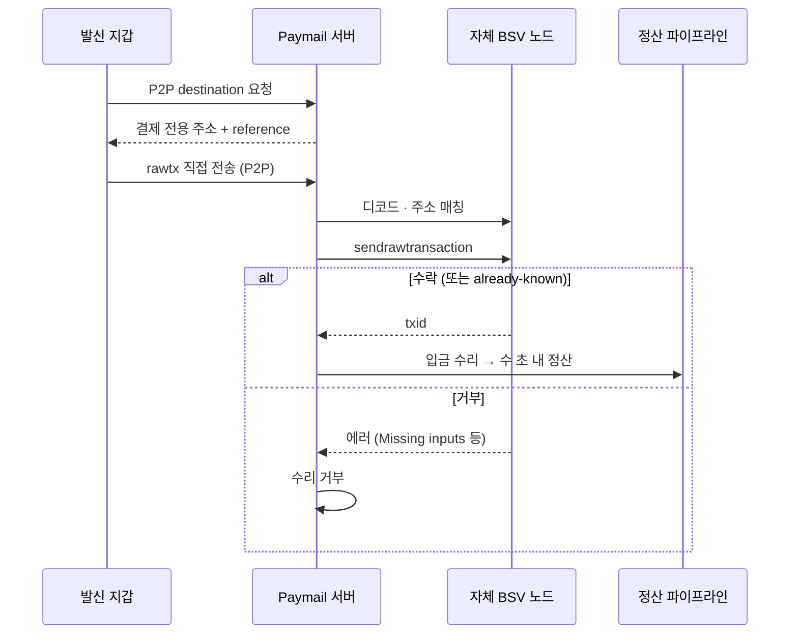
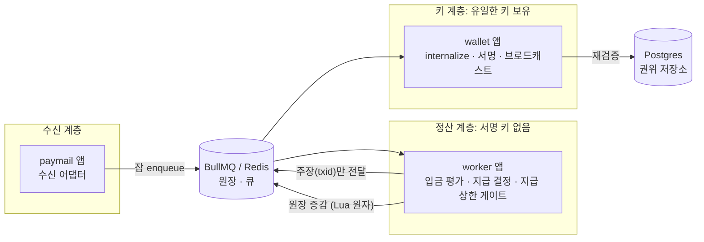
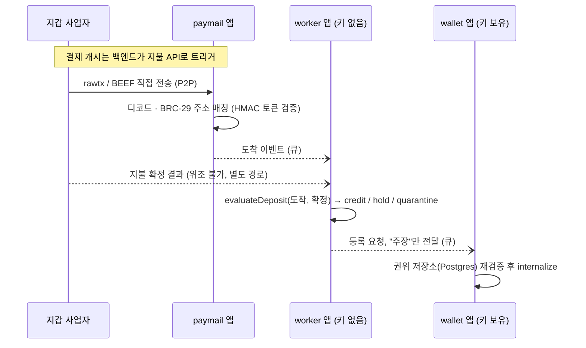

BSV 블록체인 위에서 실시간 결제 정산 백엔드를 설계하고 운영했다. 질문은 하나였다.

> 블록 확정(컨펌)은 수 분에서 수십 분 걸린다. 그런데 사용자는 입금 후 수 초 안에
> 결과를 봐야 한다. 확정되지 않은 트랜잭션을 언제, 무슨 근거로 믿을 것인가?

완성된 시스템 자랑이 아니라 이 질문에 두 번 다르게 답했던 과정의 기록이다. 첫 번째
답의 한계를 알아채고 두 번째 답으로 옮겨간 과정.

## 1. 배경

온체인 입금은 본질적으로 비동기적이고 확률적이다. 트랜잭션은 네트워크에 전파된 뒤에도
채굴 전까지 언제든 무효화될 수 있고, 채굴 여부와 시점은 통제할 수 없다. 컨펌을
기다리면 정산까지 수 분에서 수십 분이 걸린다.

요구사항은 정반대였다. 결제를 보내면 수 초 안에 입금이 인식되고, 잔고가 반영되고,
후속 처리가 끝나야 한다. 확률적 이벤트를 결정적 이벤트처럼 다뤄야 했다.

선택지는 셋이었다.

| 선택지 | 지연 | 리스크 |
|---|---|---|
| N컨펌 대기 | 수 분~수십 분 | 없음에 가까움 |
| 0-컨펌 즉시 수리 | 수 초 | 이중지급 |
| 제3자 보증(수탁) | 수 초 | 수탁 리스크·수수료·종속 |

0-컨펌을 택했다. 그 순간부터 문제는 "빠르게 만드는 것"이 아니라 "수리한 트랜잭션이
무효가 될 리스크를 누가 지고 얼마까지 지는가"가 됐다.

## 2. 아키텍처

수신 경로는 BSV의 [Paymail](https://tsc.bsvblockchain.org/standards/paymail/) 프로토콜,
그중 P2P Payment Destination 흐름이다. 발신 지갑이 서버에 지불 목적지를 물으면 서버가
해당 결제 1회 전용 주소(BRC-29 파생)를 발급하고, 발신 지갑은 서명된 raw 트랜잭션을
직접 밀어넣는다. 블록체인을 경유해 입금을 발견하는 게 아니라 트랜잭션 원문이 서버에
먼저 도착한다.

이 설계의 이점이 시스템 전체를 결정했다.

1. 수신이 곧 원문 확보다. 체인 스캔이나 폴링 없이 입금 tx 전체를 즉시 손에 쥔다.
2. 전파 주도권이 우리에게 있다. 받은 tx를 직접 네트워크에 브로드캐스트할 수 있다.
3. 브로드캐스트의 수락/거부 자체를 입금 수리 판정에 쓸 수 있다.

첫 번째 설계(v1)의 전체 흐름은 이렇다.



정산 파이프라인은 NestJS 모노레포에서 앱 경계로 책임을 나눴다. paymail 앱은 수신
어댑터로, 도착한 tx를 디코드하고 매칭만 한 뒤 무거운 일은 전부 큐로 넘긴다. 요청
경로에서 외부 API를 기다리지 않는다. worker 앱은 정산 로직(입금 평가, 후속 처리,
지급 결정)을 맡되 서명 키가 없다. wallet 앱이 유일하게 키를 갖고 UTXO
등록(internalize)과 송금 서명·브로드캐스트만 담당한다.

앱 간 연결은 전부 BullMQ(Redis) 큐다. worker가 wallet에 보내는 건 "이 txid를
등록하라"는 주장뿐이고, wallet은 자기 권위 저장소(Postgres)에서 다시 검증한다.
producer를 신뢰하지 않으니 worker가 통째로 탈취돼도 위조 입금을 만들 수 없다.



지연의 실제 병목은 검증이 아니라 전파 대기였다. 받은 tx를 먼저 브로드캐스트하고 원문을
로컬 캐시에 실어서, 후속 단계인 SPV 증명 조립이 외부 인덱서의 인지를 기다리지 않게
만든 것이 "수 초"를 지킨 실질적인 부분이다. 한번은 다수 입력을 통합한 대형 입금의 증명
조립이 순차 재귀 구현에서 69초까지 늘어진 걸 관측하고 계층 단위 벌크 조회로 다시 써서
수 초로 줄이기도 했다([관련 글](/posts/spv-proof-assembly/)).

## 3. 왜 브로드캐스트 수락이 검증인가 (v1)

0-컨펌 수리의 유일한 실질 위협은 이중지급이다. 같은 UTXO를 쓰는 상충 트랜잭션이 먼저
채굴되면 수리한 입금은 무효가 된다.

BSV 노드는 first-seen 규칙으로 동작한다. 어떤 입력(UTXO)을 소비하는 트랜잭션을 처음
보면 mempool에 수락하고, 같은 입력을 소비하는 이후 트랜잭션은 거부한다(RBF 없음). 따라서

> 노드가 `sendrawtransaction`을 수락했다
> = 노드의 관측 범위에서 이 입력을 쓰는 트랜잭션은 이것이 처음이다
> = 이중지급 시도가 존재하지 않는다는 방증.

방증이지 증명이 아니라는 점이 이 설계의 전부다(4장). 그래도 이 게이트가 매력적이었던
이유는 세 가지였다.

거의 공짜다. 어차피 전파를 위해 브로드캐스트는 해야 하고, 그 응답을 판정에 재사용할
뿐이라 추가 왕복이 없다. 거부가 유의미하다. 이미 소비된 입력(`Missing inputs`),
mempool 내 상충, 비표준 스크립트 같은 저비용 공격 대부분이 이 지점에서 자연 탈락한다.
판정도 즉각적이다. RPC 응답 한 번으로 수 초 안에 결정이 끝난다.

판정 규칙은 단순하게 유지했다. 실코드에서 개념만 재구성하면 이렇다.

```js
async function admitDeposit(rawTxHex) {
  const decoded = await node.rpc('decoderawtransaction', rawTxHex);

  // 최종성 없는 tx는 first-seen의 전제가 성립하지 않는다 → 수리 거부.
  if (decoded.locktime) {
    return { admitted: false, reason: 'non-final-locktime' };
  }

  try {
    await node.rpc('sendrawtransaction', rawTxHex);
  } catch (err) {
    // 이미 전파된 정상 tx. 거부로 처리하면 정당한 입금을 잃는다 → 수리.
    if (isAlreadyKnown(err)) {
      return { admitted: true, txid: decoded.txid };
    }
    // 자체 노드 장애일 수 있으므로 외부 브로드캐스트 API로 1회 failover.
    // failover까지 실패하면 "판정 불능"이며, 판정 불능은 수리가 아니라 거부다.
    try {
      await externalBroadcast(rawTxHex);
    } catch {
      return { admitted: false, reason: err.message }; // Missing inputs, 상충 등
    }
  }

  return { admitted: true, txid: decoded.txid };
}
```

운영하면서 이 시절의 비용도 배웠다. 자체 노드 운영은 판정 권위를 갖는 대신 UTXO 상태를
직접 책임진다는 뜻이었고, 미컨펌 체이닝 한도(`too-long-mempool-chain`) 회피나 유실
UTXO(`Missing inputs`) 복구 같은 지갑 계층 문제를 전부 손으로 풀어야 했다. 이 운영
부담이 나중에 v2 전환(6장)의 한 축이 된다.

## 4. 못 막는 것들

이 게이트가 구조적으로 못 막는 걸 정확히 아는 게 설계의 절반이었다.

**로컬 뷰의 한계.** "우리 노드가 처음 봤다"는 건 우리 노드 mempool 이야기일 뿐이다.
공격자가 상충 트랜잭션을 우리에게는 숨기고 일부 채굴자에게만 직접 제출하면, 우리
브로드캐스트는 수락되지만 채굴되는 건 상대편 tx일 수 있다. 게이트는 네트워크 전역의
first-seen을 관측하지 못한다.

**전파 순서 race.** 상충 트랜잭션 두 개가 거의 동시에 퍼지면 채굴자마다 먼저 본
트랜잭션이 다르다. 어느 쪽이 채굴될지는 해시파워 분포에 대한 확률 문제가 되고, 노드의
수락 여부는 그 결과를 보장하지 않는다.

**Reorg.** 수리한 입금이 블록에 들어간 뒤에도 체인 재편성이 일어나면 그 블록째 사라질
수 있다. 0-컨펌은 물론이고 1-컨펌도 절대적이지 않다. 확률이 지수적으로 떨어질 뿐이다.

셋 다 게이트를 더 잘 만들어서 막을 수 있는 게 아니다. 관측 기반 검증의 구조적
한계다. 그래서 방어의 축을 옮겨야 했다.

## 5. 막을 수 없으면 수지가 안 맞게 만든다

4장의 공격들은 공짜가 아니다. 로컬 뷰와 race는 채굴자와의 협조나 정교한 전파 타이밍
조작이 필요하고, reorg를 의도적으로 일으키려면 해시파워를 동원해야 한다. 공격에는 실행
비용과 실패 확률이 있다. 그렇다면 방어를 완벽한 차단이 아니라 기대 이익의 상한으로
정의할 수 있다.

> 공격 성공 시 탈취 가능액 ≤ 지급 한도 < 공격 비용이 되도록 한도를 설정하면,
> 공격은 가능하지만 무의미하다.

구현은 두 겹이다. 1차 필터는 브로드캐스트 게이트다. 비용이 거의 안 드는 공격(이미 쓴
UTXO 재사용, 단순 재전송)을 전부 걸러내서 비용이 드는 공격만 남긴다. 2차는 지급
상한이다. 단일 정산으로 나갈 수 있는 금액이 보유 준비금 풀을 넘지 못하도록 지급
시점에 게이트한다. 준비금 풀은 정산 흐름과 원자적으로 증감하는 원장으로 관리되고, 지급
요청은 풀 잔고를 넘는 순간 실행되지 않는다. 어느 경로로 공격이 성공하든 가져갈 수 있는
최대치가 풀 잔고로 상한된다.

```ts
// 풀 증감은 exactly-once. 마커(처리 txid)와 증분을 원자 결합해
// 큐 재시도·중복 전달이 이중 반영을 만들 수 없다.
export async function applyLedgerDeltaOnce(
  ledger: Ledger,
  marker: string, // 예: "dep:<txid>"
  poolKey: string,
  delta: BigNumber,
): Promise<void> {
  await ledger.atomic(({ setIfAbsent, incr }) => {
    if (!setIfAbsent(marker)) return; // 이미 반영된 이벤트라 no-op
    incr(poolKey, delta);
  });
}
```

이 구조의 함의는 게이트의 오탐·미탐 확률을 0으로 만들 필요가 없다는 것이다. 게이트는
공격의 비용 하한을 올리고 한도는 보상 상한을 내린다. 두 값이 교차하는 지점부터 시스템은
수학적으로가 아니라 경제적으로 안전하다.

## 6. 검증 권위를 옮기다 (v2)

v1을 운영하며 두 가지가 분명해졌다. 브로드캐스트 게이트는 관측 기반이라 4장의 한계를
원리적으로 못 벗어난다. 그리고 자체 노드에 수동 UTXO 관리는 정산 로직과 무관한 운영
복잡도를 계속 만든다.

그래서 v2에서는 검증 권위 자체를 옮겼다. 발신 측 지갑 사업자가 지불을 집행한 위조 불가능한
확정 결과(백엔드가 개시한 지불 API의 성공 응답)를 크레딧의 권위로 삼고, 온체인 도착은
그 확정과 대사(reconcile)하는 대상으로 격하시켰다. 도착 트랜잭션은 결제 1회 전용
주소(BRC-29 파생, HMAC 자기인증 토큰으로 stateless 발급)로만 매칭되므로 제3자가 임의
입금으로 크레딧을 위조할 경로가 없다.



입금 평가는 순수 함수로 분리했다. "도착했는데 확정이 아직 안 왔다"를 격리가 아니라
대기로 처리하는 게 핵심이다. 두 신호는 어느 쪽이 먼저 올지 알 수 없는 독립 이벤트라서.

```ts
export function evaluateDeposit(
  arrivingAddress: string | undefined,
  invoice: StoredInvoice | null,
): Decision {
  if (!arrivingAddress) {
    return { action: 'quarantine', reason: 'no-address' };
  }
  if (!invoice || invoice.address !== arrivingAddress) {
    // 발급 레코드 없음 = 비요청 입금 또는 공격자. 자동 크레딧 경로 없음.
    return { action: 'quarantine', reason: 'no-matching-invoice' };
  }
  // 터미널 상태 먼저. 재전달·중복 트리거에 대한 멱등성.
  if (invoice.status === 'credited' || invoice.status === 'quarantined') {
    return { action: 'quarantine', reason: `already-${invoice.status}` };
  }
  if (!invoice.hasPayResult) {
    return { action: 'hold', reason: 'awaiting-payresult' }; // 레이스 흡수
  }
  return { action: 'credit', address: invoice.address };
}
```

브로드캐스트는 게이트에서 전파 가속으로 역할이 바뀌었다. 받은 tx를 즉시 전파해 후속
파이프라인(SPV 증명 조립, UTXO 등록)의 대기를 없애는 게 목적이고, 실패해도 정산은
진행된다. 브로드캐스트 자체는 관리형 지갑 스택과 ARC(트랜잭션 처리 API)로 이관했는데,
여기서 판정 문제가 또 반복됐다. 벤더 SDK가 ARC 라이프사이클의 중간
상태(`ANNOUNCED_TO_NETWORK` 등)를 실패로 오판정해 살아있는 엔드포인트를 매번
폴백시키고 있었다. 접수 이후 상태 전부를 성공으로, 거부·이중지급류만 실패로 보는 관용
래퍼를 직접 씌워야 했다([관련 글](/posts/broadcast-verdict/)).

v1의 경제적 방어인 지급 상한은 v2에서도 그대로다. 권위가 무엇이든 지급은 준비금 풀을
넘지 못한다.

## 7. 정직한 한계

**방어는 논증됐을 뿐 실측되지 않았다.** 운영 기간 중 실제 이중지급 공격은 관측되지
않았다. 이건 "방어가 작동했다"의 근거가 아니라 "방어가 시험받지 않았다"는 뜻이다.
4장의 공격 표면 분석과 5장의 경제 논증은 실전 데이터가 아니라 추론이다.

검증하려면 이런 테스트가 필요한데 실행하지 못했다.

- 상충 tx 쌍을 서로 다른 네트워크 진입점에 동시 제출하는 race 재현. 게이트 수락 후
  상대편 tx가 채굴되는 빈도 측정
- regtest/테스트넷에서의 의도적 reorg 시뮬레이션. 수리 취소·원장 롤백 경로 검증
- 지급 상한 게이트에 대한 property-based 테스트. 어떤 정산 순서에서도 누적 지급이
  풀 잔고를 초과하지 않음을 불변식으로 검증

**v2는 검증 문제를 풀었다기보다 옮겼다.** 크레딧 권위를 지갑 사업자의 확정 API에 두는
건 그 사업자의 정직성과 가용성에 대한 의존이다. 관측 리스크를 상대방 리스크로 교환한
것이고, 그 교환이 유리하다는 판단이지 리스크가 사라진 건 아니다.

**지급 상한의 값 자체는 정교하지 않다.** "공격 비용 > 기대 보상"의 경계값을 실제
해시파워 시장가로 계산한 게 아니라 준비금 풀이라는 보수적 상한을 쓴 것이다. 경계값
산정까지는 하지 못했다.

## 8. 남는 것

0-컨펌 정산은 속도 문제가 아니었다. 속도는 전파 경로 최적화로 해결되는 엔지니어링
문제였고, 진짜 문제는 확정되지 않은 사실을 수리하는 리스크를 어디로 넘기고 남는 리스크를
무엇으로 상한하느냐였다.

v1은 리스크를 관측(first-seen 방증)으로 줄이고 경제(지급 상한)로 상한했다. v2는
리스크를 계약(위조 불가 확정 API)으로 넘기고 같은 경제적 상한을 유지했다.

두 답 모두 "이중지급을 막는다"고 말하지 않는다. v1은 저비용 공격을 걸러내고 고비용
공격은 무의미하게 만든다는 것이고, v2는 검증을 더 잘하는 주체에게 위임하고 우리는
대사와 상한을 지킨다는 것이다. 완벽한 검증이 불가능한 환경에서 시스템을 지탱하는 건
게이트의 정확도가 아니라 못 막는 걸 정확히 알고 그 피해를 상한하는 구조였다.

### 지금 다시 만든다면

이 고민의 상당 부분은 체인의 합의 특성에서 왔다. 솔라나였다면 문제의 모양 자체가
달라진다. 슬롯이 약 400ms이고 낙관적 컨펌(supermajority 투표)이 1~2초, 결정적
파이널리티도 십수 초 안에 오니까 "확정을 기다릴 수 없어서 미확정을 수리한다"는 전제가
무너진다. 그냥 컨펌을 기다려도 수 초 예산 안에 들어오고, first-seen 방증이나 경쟁
브로드캐스트 race를 논증할 필요가 없다.

대신 리스크가 다른 곳으로 옮겨간다. 트랜잭션이 blockhash 만료(약 60초)로 조용히
드롭되는 걸 전제로 한 멱등 재제출 설계, 혼잡 시 우선순위 수수료 산정, RPC 공급자
가용성 의존, 그리고 도착을 직접 밀어주는 Paymail 같은 P2P 수신 계층이 없어 계정 구독과
reference 키 매칭으로 입금을 상관시키는 문제가 생긴다. 검증 리스크가 가용성·전달
리스크로 바뀌는 것이지 리스크가 사라지지는 않는다. 지급 상한과 exactly-once 원장 같은
경제적·회계적 방어 층은 체인이 무엇이든 그대로 필요했을 것이다.

---

*본문의 코드는 실서비스 코드에서 시크릿과 운영 구성을 제거하고 개념만 재구성한 발췌다.
실행이 아니라 읽기를 위한 것.*
